# Hotel Manager

Full-stack aplikácia na správu hotelov, izieb, rezervácií a používateľov, nasadená na **AWS EKS** pomocou **Terraform** (Infrastructure as Code) s kompletnou **CI/CD pipeline** postavenou na GitHub Actions.

Projekt vznikol ako portfóliová ukážka DevOps a full-stack kompetencií: od aplikačnej vrstvy (Spring Boot + Angular) cez kontajnerizáciu (Docker) a orchestráciu (Kubernetes) až po provisioning cloudovej infraštruktúry a automatizované nasadzovanie.

---

## Obsah

- [Architektúra](#architektúra)
- [Použité technológie](#použité-technológie)
- [Funkcionalita aplikácie](#funkcionalita-aplikácie)
- [Štruktúra repozitára](#štruktúra-repozitára)
- [CI/CD pipeline](#cicd-pipeline)
- [Ukážky](#ukážky)
- [Lokálne spustenie (kind)](#lokálne-spustenie-kind)
- [Nasadenie na AWS – kompletný návod](#nasadenie-na-aws--kompletný-návod)
- [Odstránenie infraštruktúry (teardown)](#odstránenie-infraštruktúry-teardown)
- [Riešené technické problémy](#riešené-technické-problémy)
- [Roadmap](#roadmap)

---

## Architektúra

Aplikácia beží v privátnych podsieťach VPC. Verejný prístup zabezpečuje Application Load Balancer (ALB), ktorý je automaticky provisionovaný cez AWS Load Balancer Controller na základe Kubernetes Ingress objektu. Perzistentnú vrstvu tvorí spravovaná MySQL databáza (Amazon RDS).

```
                          Internet
                             │
                             ▼
              ┌──────────────────────────────┐
              │  Application Load Balancer    │   ← internet-facing
              │  (AWS ALB Controller)         │
              └──────────────┬───────────────┘
                             │  Ingress routing
          ┌──────────────────┼─────────────────────┐
          │  /               │  /api, /oauth2,      │
          │                  │  /login/oauth2       │
          ▼                  ▼                      │
   ┌─────────────┐    ┌─────────────┐               │
   │  frontend   │    │  backend    │               │
   │  (Angular   │    │ (Spring Boot│               │
   │   + nginx)  │    │   + JWT)    │               │
   │  3 repliky  │    │  1–2 repliky│               │
   └─────────────┘    └──────┬──────┘               │
                             │                      │
        VPC (10.0.0.0/16) – privátne podsiete       │
                             │                      │
                             ▼                      │
                    ┌─────────────────┐             │
                    │   Amazon RDS     │             │
                    │  (MySQL 8.0)     │             │
                    └─────────────────┘             │
                                                    │
   ┌────────────────────────────────────────────────┘
   │  Amazon ECR  ──►  Docker images (backend / frontend)
   │  IAM + OIDC  ──►  federácia pre GitHub Actions (bez trvalých kľúčov)
   └────────────────────────────────────────────────
```

Celá infraštruktúra (VPC, EKS, RDS, ECR, ALB Controller, IAM role, OIDC provider) je definovaná ako kód v adresári [`terraform/`](terraform/).

---

## Použité technológie

| Vrstva | Technológia |
|---|---|
| **Backend** | Java 21, Spring Boot 3.4.5, Spring Security (JWT + Google OAuth2), Spring Data JPA / Hibernate |
| **Frontend** | Angular 21, Angular Material, nginx (produkčný servírovací kontajner) |
| **Databáza** | MySQL 8.0 (Amazon RDS v cloude, lokálne MySQL v kontajneri) |
| **Kontajnerizácia** | Docker (multi-stage build, Alpine base images, non-root user) |
| **Orchestrácia** | Kubernetes (Amazon EKS v cloude, kind lokálne), Helm (AWS Load Balancer Controller) |
| **Infrastructure as Code** | Terraform (`terraform-aws-modules`: vpc, eks, rds, iam) |
| **CI/CD** | GitHub Actions (CI backend/frontend, CD s OIDC federáciou) |
| **Cloud** | AWS – EKS, RDS, ECR, ALB, IAM/IRSA, Secrets Manager, VPC |

---

## Funkcionalita aplikácie

- **Autentifikácia dvoma spôsobmi** – klasické prihlásenie e-mailom a heslom (JWT) aj prihlásenie cez Google (OAuth2).
- **Rolový model** – `ADMIN`, `MANAGER`, `USER`, s riadením prístupu na úrovni endpointov aj metód.
- **Správa hotelov, izieb a rezervácií** – CRUD operácie s väzbami medzi entitami.
- **Administrácia používateľov** – priradenie rolí a hotelov manažérom (dostupné pre rolu `ADMIN`).

Doménový model tvoria entity `User`, `Hotel`, `Room` a `Booking` s príslušnými REST kontrolérmi (`AuthController`, `HotelController`, `RoomController`, `BookingController`, `AdminController`).

---

## Štruktúra repozitára

```
hotel-manager/
├── backend/                  # Spring Boot aplikácia (Java 21)
│   ├── src/main/java/...      # controllers, services, entities, security, config
│   ├── src/main/resources/    # application.properties, data.sql (seed dáta)
│   └── Dockerfile             # multi-stage build (JDK build → JRE runtime)
├── frontend/                 # Angular 21 aplikácia
│   ├── src/                   # komponenty, služby, interceptory
│   ├── nginx.conf             # produkčná nginx konfigurácia
│   └── Dockerfile             # multi-stage build (node build → nginx serve)
├── kubernetes/               # Kubernetes manifesty
│   ├── backend-*.yaml         # Deployment + Service
│   ├── frontend-*.yaml        # Deployment + Service
│   ├── configmap.yaml         # nesenzitívna konfigurácia
│   ├── secret.example.yaml    # šablóna secretu (bez reálnych hodnôt)
│   ├── ingress.yaml           # ALB Ingress (routing pravidlá)
│   ├── kind-config.yaml       # lokálny kind cluster
│   └── mysql-*.yaml           # lokálna MySQL (len pre kind, na AWS je RDS)
├── terraform/                # Infrastructure as Code
│   ├── vpc.tf, eks.tf, rds.tf, ecr.tf
│   ├── alb-controller.tf      # ALB Controller cez Helm + IRSA
│   ├── oidc.tf                # OIDC provider + IAM role pre GitHub Actions
│   └── outputs.tf, variables.tf, providers.tf
├── .github/workflows/        # CI/CD pipeline
│   ├── ci-backend.yml
│   ├── ci-frontend.yml
│   └── cd.yml
└── screenshots/              # ukážky nasadenia a funkčnosti
```

---

## CI/CD pipeline

Projekt používa tri oddelené GitHub Actions workflowy:

**CI (`ci-backend.yml`, `ci-frontend.yml`)** – spúšťajú sa pri každom pushi (path-based triggery). Overujú, že sa kód skompiluje a Docker image sa dá zostaviť. Používajú dependency caching a concurrency groups. Images sa v CI **nepushujú** – slúžia len na validáciu kvality.

**CD (`cd.yml`)** – spúšťa sa pri pushi do `main` (zmeny v `backend/` alebo `frontend/`). Kroky:

1. Autentifikácia voči AWS cez **OIDC federáciu** – žiadne trvalé prístupové kľúče, žiadne GitHub Secrets. Dôvera je nastavená v Terraforme (`oidc.tf`), token sa generuje dynamicky pri každom behu a je viazaný priamo na tento repozitár.
2. Build Docker images (backend aj frontend), tagovanie podľa **git SHA** (nikdy `:latest`).
3. Push do Amazon ECR.
4. `kubectl set image` – rollout novej verzie na EKS.
5. `kubectl rollout status` – overenie, že nasadenie prebehlo úspešne.

Prečo OIDC namiesto trvalých kľúčov: dlhodobé prístupové kľúče uložené v GitHub Secrets predstavujú bezpečnostné riziko (pri úniku fungujú útočníkovi až do manuálneho zneplatnenia). OIDC federácia toto eliminuje – runner si vypýta krátkodobý token, ktorý AWS uzná len na základe overenia, že požiadavka prišla presne z tohto repozitára.

---

## Ukážky

### Aplikácia

**Prihlasovacia obrazovka**

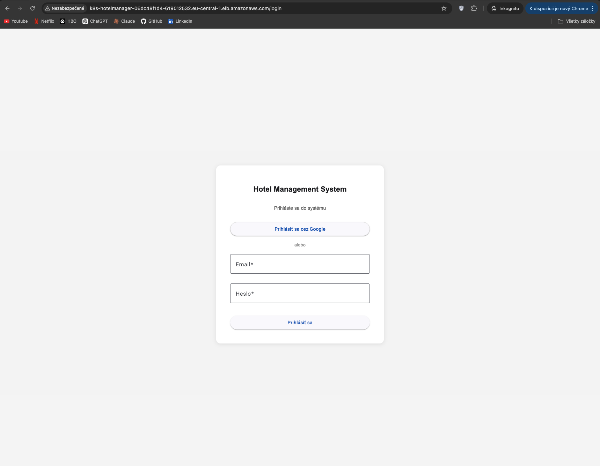

**Prihlásenie cez Google OAuth2 (funkčné aj pri viacerých replikách backendu)**

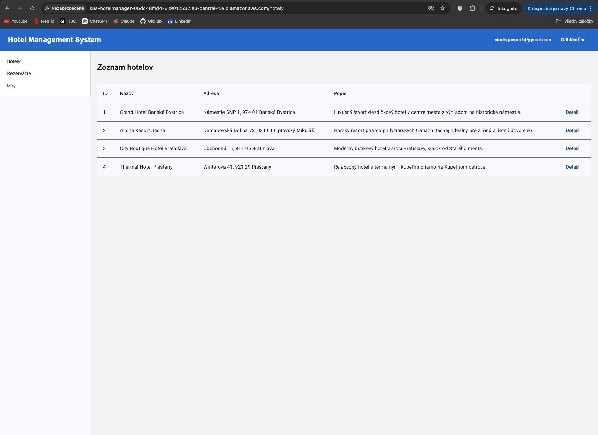

**Administrácia – prehľad používateľov**

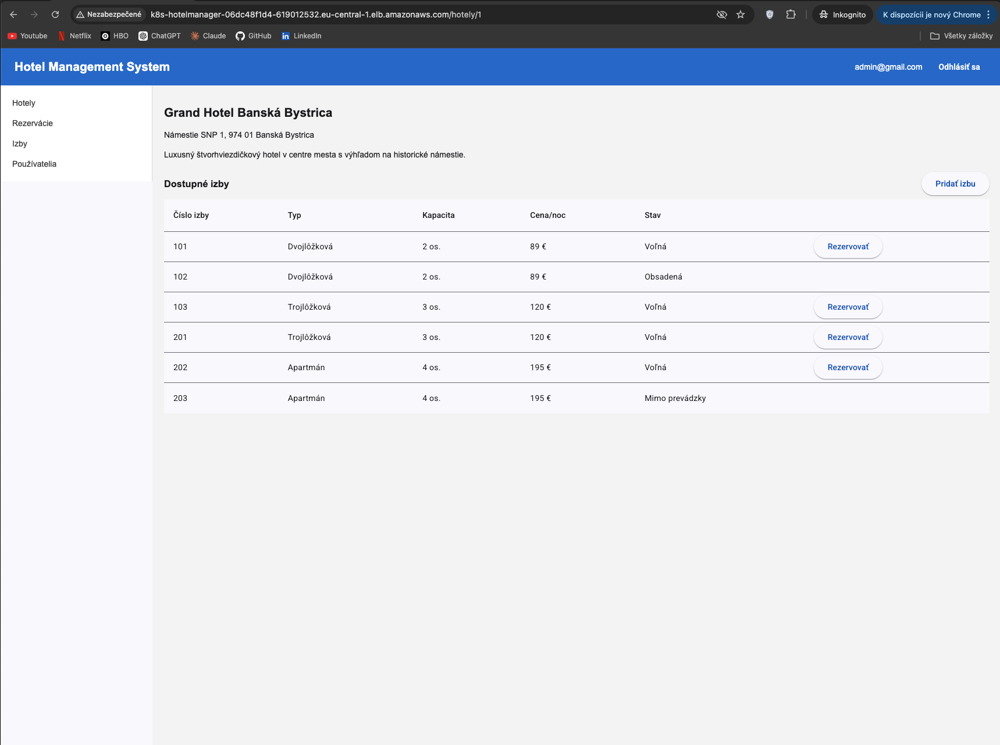
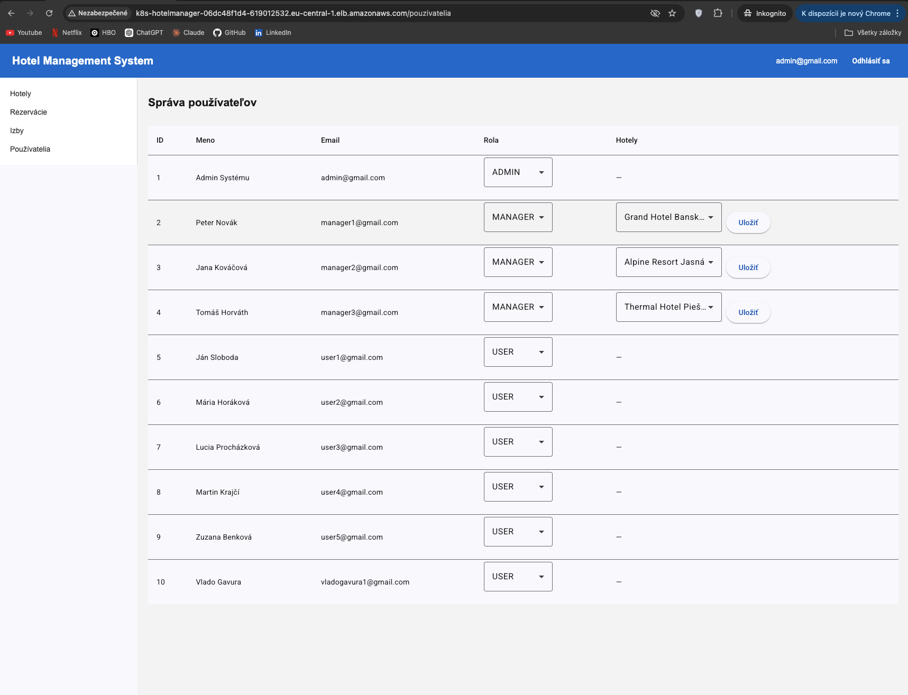

### AWS infraštruktúra

**EKS cluster**

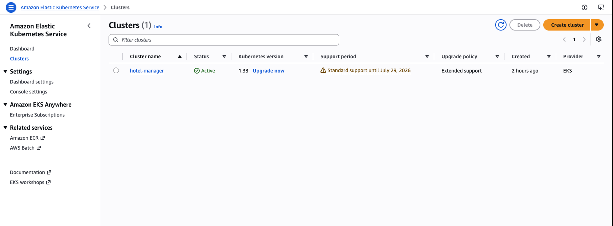

**EKS node group**

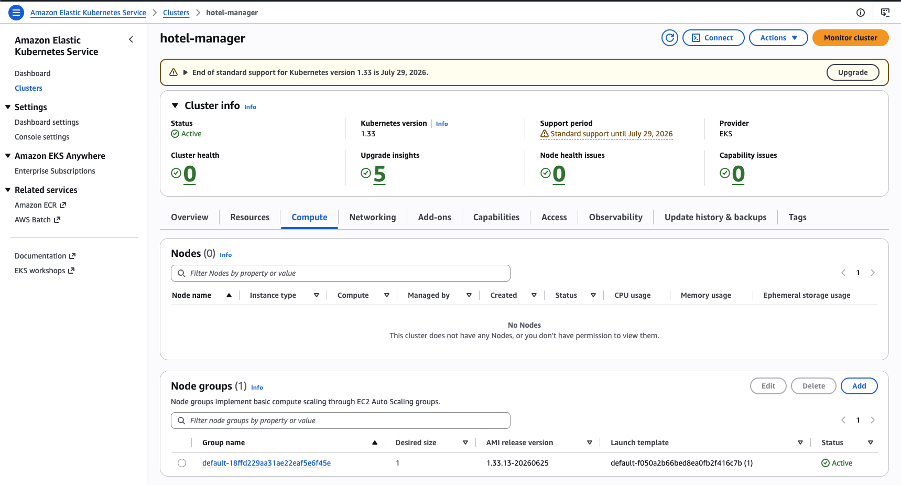

**Amazon RDS (MySQL)**

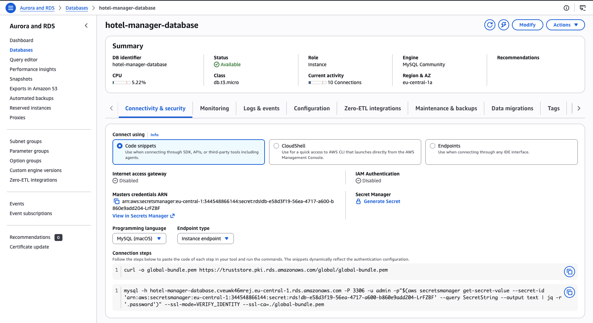

**Amazon ECR – image repozitáre**

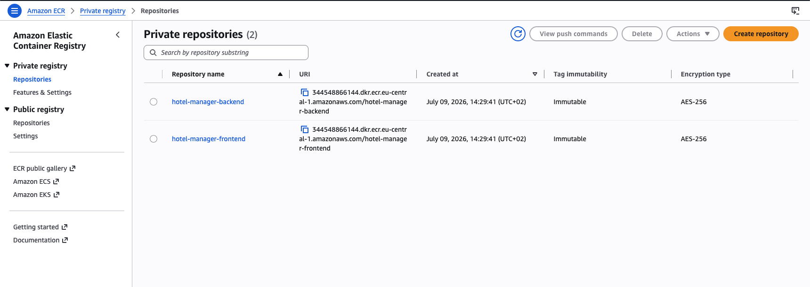

**Application Load Balancer**

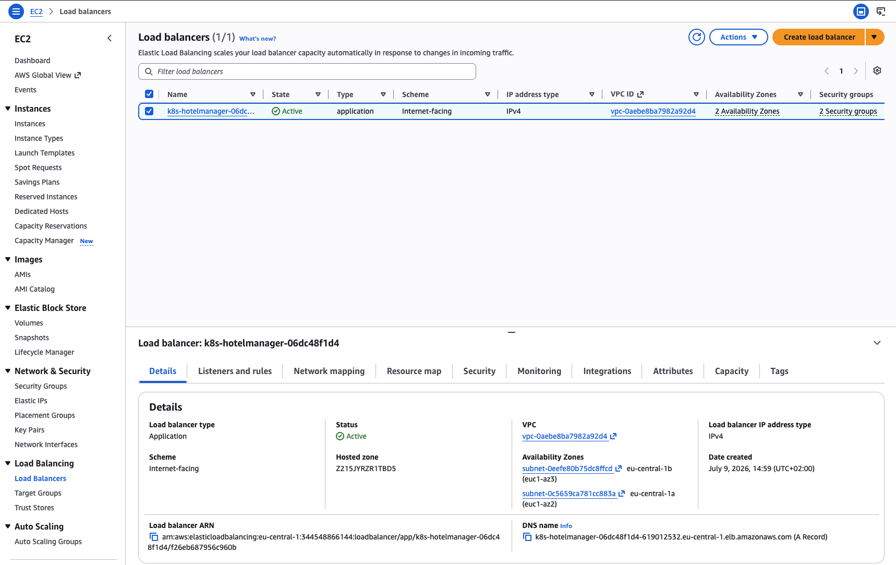

**IAM rola s OIDC federáciou pre GitHub Actions**

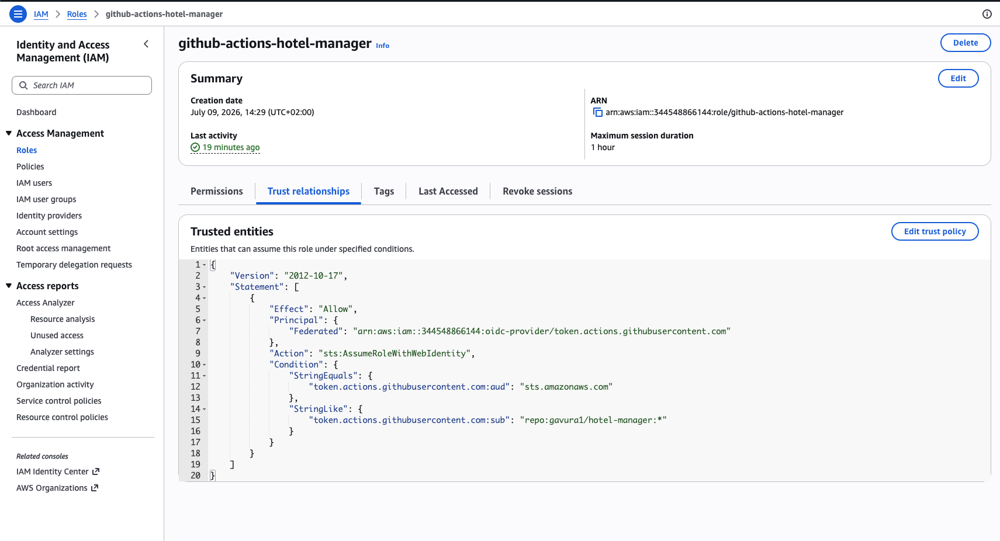

### CI/CD

**GitHub Actions – prehľad**

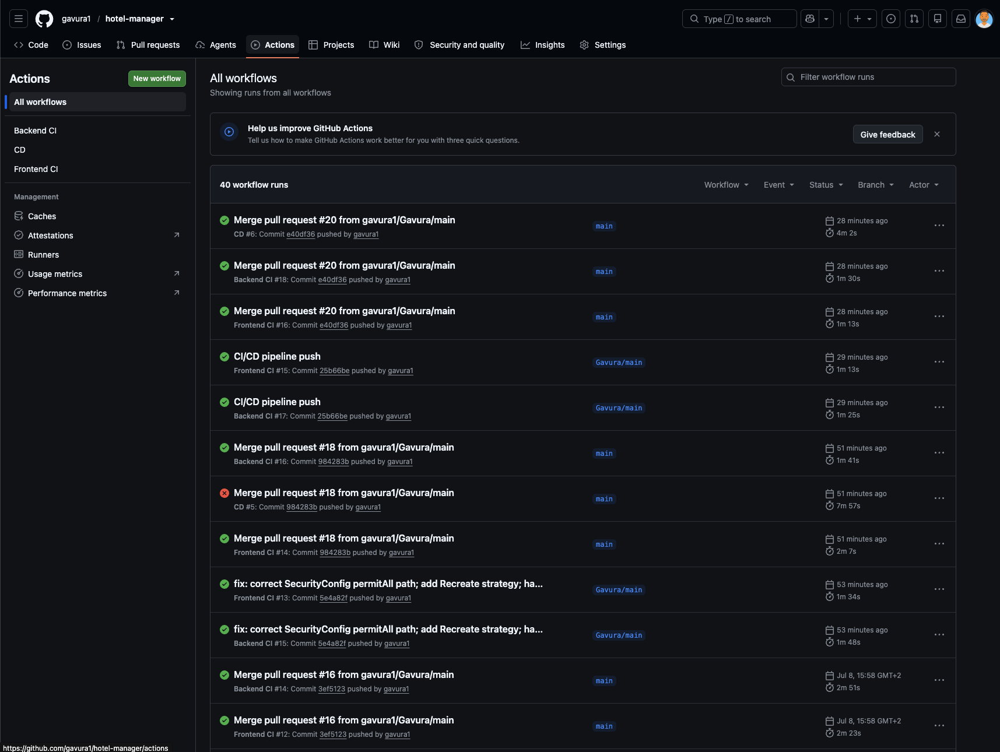

**CD pipeline**

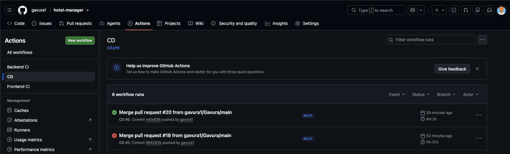

**CI backend / CI frontend**

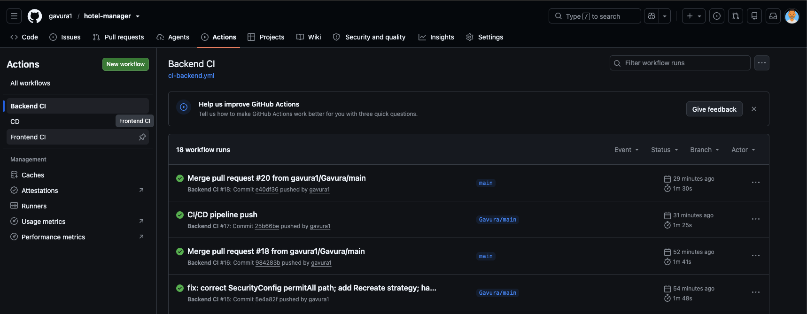
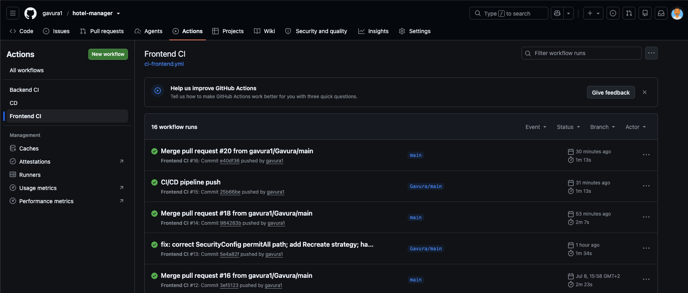

### Terraform a Kubernetes

**Terraform apply**

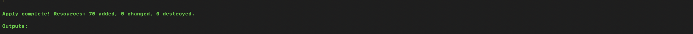

**kubectl – pods / ingress / nodes**

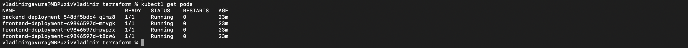
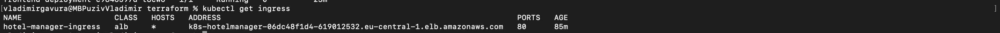


---

## Lokálne spustenie (kind)

Pre lokálny vývoj a testovanie bez cloudových nákladov je pripravený **kind** (Kubernetes in Docker) cluster.

**Predpoklady:** Docker, kubectl, kind.

```bash
# 1. Vytvor lokálny cluster
kind create cluster --config kubernetes/kind-config.yaml

# 2. Nainštaluj nginx ingress controller
kubectl apply -f https://raw.githubusercontent.com/kubernetes/ingress-nginx/main/deploy/static/provider/kind/deploy.yaml

# 3. Zostav a načítaj images do kind
docker build -t hotel-manager-backend:local ./backend
docker build -t hotel-manager-frontend:local ./frontend
kind load docker-image hotel-manager-backend:local --name kind
kind load docker-image hotel-manager-frontend:local --name kind

# 4. Priprav secret zo šablóny
cp kubernetes/secret.example.yaml kubernetes/secret.yaml
#    a doplň reálne hodnoty (Google OAuth2, JWT secret, DB heslo)

# 5. Aplikuj manifesty
kubectl apply -f kubernetes/
```

> Pri lokálnom behu sa používa MySQL v kontajneri (`mysql-*.yaml`). Na AWS sa tieto súbory nepoužívajú – tam databázu poskytuje Amazon RDS.

---

## Nasadenie na AWS – kompletný návod

Tento návod obsahuje **všetky kroky vrátane manuálnych**, ktoré sú potrebné na nasadenie od nuly. Niektoré hodnoty (RDS endpoint, RDS heslo, ALB DNS) generuje AWS až počas nasadenia a nie sú deterministické – preto sa doplnia manuálne v priebehu postupu.

**Predpoklady:** AWS CLI v2 (nakonfigurované), Terraform, kubectl, Docker, aktívny Google OAuth2 client v Google Cloud Console.

### 1. Provisioning infraštruktúry

```bash
cd terraform
terraform init
terraform apply      # ~15–20 min (najpomalšia časť je EKS control plane)
```

Terraform vytvorí VPC, EKS cluster, RDS, ECR repozitáre, ALB Controller (cez Helm), IAM role a OIDC provider.

### 2. Zostav a nahraj Docker images do ECR

> Poznámka k architektúre: EKS node group beží na `t3.small` (amd64). Pri buildovaní na Apple Silicon (ARM64) je nutné použiť `--platform linux/amd64`, inak sa image na node nespustí.

```bash
aws ecr get-login-password --region eu-central-1 \
  | docker login --username AWS --password-stdin <ACCOUNT_ID>.dkr.ecr.eu-central-1.amazonaws.com

docker build --platform linux/amd64 \
  -t <ACCOUNT_ID>.dkr.ecr.eu-central-1.amazonaws.com/hotel-manager-backend:v1 ./backend
docker push <ACCOUNT_ID>.dkr.ecr.eu-central-1.amazonaws.com/hotel-manager-backend:v1

docker build --platform linux/amd64 \
  -t <ACCOUNT_ID>.dkr.ecr.eu-central-1.amazonaws.com/hotel-manager-frontend:v1 ./frontend
docker push <ACCOUNT_ID>.dkr.ecr.eu-central-1.amazonaws.com/hotel-manager-frontend:v1
```

V `kubernetes/backend-deployment.yaml` a `frontend-deployment.yaml` nastav `image` na plnú ECR URL s príslušným tagom.

### 3. Priprav prístup ku clusteru

```bash
aws eks update-kubeconfig --name hotel-manager --region eu-central-1
kubectl get nodes    # over, že node je v stave Ready
```

### 4. Nastav RDS pripojenie (endpoint + heslo)

RDS endpoint a heslo generuje AWS dynamicky.

```bash
# Endpoint
terraform output rds_endpoint
```

Do `kubernetes/configmap.yaml` → `SPRING_DATASOURCE_URL`:
```
jdbc:mysql://<RDS_ENDPOINT>/hotel_manager_database?useSSL=true&serverTimezone=UTC&allowPublicKeyRetrieval=true
```

Heslo je spravované AWS (`manage_master_user_password = true`) a uložené v Secrets Manageri:

```bash
# Zisti ARN secretu
aws rds describe-db-instances --db-instance-identifier hotel-manager-database \
  --query 'DBInstances[0].MasterUserSecret.SecretArn' --output text

# Získaj heslo (ARN daj do jednoduchých úvodzoviek – obsahuje znak '!')
aws secretsmanager get-secret-value --secret-id '<SECRET_ARN>' \
  --query SecretString --output text \
  | python3 -c "import sys, json; print(json.load(sys.stdin)['password'])"
```

Zakóduj heslo do Base64 a vlož do `kubernetes/secret.yaml` → `SPRING_DATASOURCE_PASSWORD`:

```bash
echo -n '<HESLO>' | base64
```

> `secret.yaml` sa neverzuje v gite. Vytvor ho zo šablóny: `cp kubernetes/secret.example.yaml kubernetes/secret.yaml` a doplň všetky hodnoty (DB, Google OAuth2 secret, JWT secret).

### 5. Aplikuj Kubernetes manifesty

```bash
kubectl apply -f kubernetes/secret.yaml
kubectl apply -f kubernetes/configmap.yaml
kubectl apply -f kubernetes/backend-deployment.yaml
kubectl apply -f kubernetes/backend-service.yaml
kubectl apply -f kubernetes/frontend-deployment.yaml
kubectl apply -f kubernetes/frontend-service.yaml
kubectl apply -f kubernetes/ingress.yaml
```

### 6. Doplň ALB DNS meno

ALB vzniká až po vytvorení Ingressu a jeho DNS meno nie je vopred známe.

```bash
kubectl get ingress hotel-manager-ingress    # počkaj 1–3 min na stĺpec ADDRESS
```

Do `kubernetes/configmap.yaml` doplň reálne ALB DNS meno do troch premenných:

```yaml
OAUTH2_REDIRECT_URI: "http://<ALB_DNS>/login/oauth2/code/google"
CORS_ALLOWED_ORIGINS: "http://<ALB_DNS>"
FRONTEND_REDIRECT_URI: "http://<ALB_DNS>"
```

Aplikuj a reštartuj backend (zmena ConfigMapu sa do bežiacich podov nepremietne automaticky):

```bash
kubectl apply -f kubernetes/configmap.yaml
kubectl rollout restart deployment/backend-deployment
kubectl rollout status deployment/backend-deployment
```

### 7. Zaregistruj redirect URI v Google Cloud Console

Google Cloud Console → **APIs & Services → Credentials** → OAuth 2.0 Client ID → **Authorized redirect URIs** → pridaj:

```
http://<ALB_DNS>/login/oauth2/code/google
```

### 8. Over funkčnosť

Otvor `http://<ALB_DNS>` a otestuj:
- prihlásenie e-mailom a heslom (napr. seed účet `admin@gmail.com`),
- prihlásenie cez Google,
- zobrazenie seed dát (hotely, izby, používatelia).

Po overení možno backend škálovať na 2 repliky:

```bash
kubectl scale deployment/backend-deployment --replicas=2
```

### 9. Automatizované nasadzovanie (CD)

Po prvom manuálnom nasadení preberá ďalšie nasadenia CD pipeline. Push do `main` (zmena v `backend/` alebo `frontend/`) automaticky zostaví images, nahrá ich do ECR a spraví rollout na EKS – bez manuálneho zásahu.

---

## Odstránenie infraštruktúry (teardown)

Zdroje vytvorené ALB Controllerom (ALB, target groups, security groups) žijú mimo Terraform state, preto sa musia odstrániť v správnom poradí:

```bash
# 1. Najprv zmaž Ingress a počkaj, kým ALB zanikne
kubectl delete -f kubernetes/ingress.yaml
aws elbv2 describe-load-balancers    # opakuj, kým ALB nezmizne zo zoznamu

# 2. Zruš infraštruktúru
cd terraform
terraform destroy

# 3. Skontroluj a odstráň prípadné osirelé zdroje
aws elbv2 describe-load-balancers
aws elbv2 describe-target-groups
aws ec2 describe-security-groups \
  --filters "Name=tag:elbv2.k8s.aws/cluster,Values=hotel-manager"
```

## Riešené technické problémy

Prehľad netriviálnych problémov, ktoré boli počas vývoja diagnostikované a vyriešené:

- **Google OAuth2 v stateless architektúre** – predvolené ukladanie OAuth2 authorization requestu do HTTP session nefunguje pri `SessionCreationPolicy.STATELESS`. Riešené vlastnou cookie-based implementáciou `AuthorizationRequestRepository`, ktorá funguje aj pri viacerých replikách backendu.
- **Routing OAuth2 endpointov** – Ingress musí smerovať `/oauth2/**` a `/login/oauth2/**` priamo na backend bez `/api` prefixu, inak ich Spring Security filter nezachytí.
- **Idempotentné seedovanie dát** – `data.sql` používa `INSERT IGNORE`, aby opakovaný štart podov ani súbežný nábeh viacerých replík nespôsobil duplicity ani pády.
- **Kapacita node group** – na jednom `t3.small` node platí limit počtu podov. Deploymenty preto používajú `strategy: Recreate`, aby rolling update nevyžadoval dočasnú kapacitu navyše (surge pod), ktorá by zostala v stave `Pending`.
- **Konzistencia image tagov** – používajú sa nemeniteľné tagy (git SHA / verzia), nikdy `:latest`, aby Kubernetes spoľahlivo detegoval zmenu a spustil rollout. ECR repozitáre sú nastavené ako `IMMUTABLE`.
- **Bezpečnosť CI/CD** – OIDC federácia namiesto trvalých prístupových kľúčov, IAM oprávnenia podľa princípu najmenších práv.

---

## Roadmap

- **Monitoring a logging** – integrácia Prometheus + Grafana (metriky) a Loki + Promtail (logy) cez Helm. *Vo vývoji.*
- **TLS / HTTPS** – vlastná doména cez Route53 a automatické certifikáty (cert-manager / ACM) namiesto holého ALB DNS.
- **GitOps** – zváženie ArgoCD pre deklaratívne nasadzovanie vrátane Kubernetes manifestov.

---

*Časti tohto projektu (najmä debugging a infraštruktúrny kód) vznikli s asistenciou AI nástrojov, čo je uvedené aj v príslušných commit správach.*
